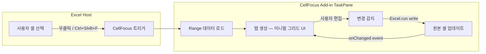

# CellFocus — Excel 집중 편집 Add-in 구현 계획

복잡한 Excel 파일에서 필요한 셀 범위만 골라 새 탭(패널 내 탭)으로 분리하고, 원본과 실시간 동기화하며, 리본/도구 모음 없이 **집중 편집**하는 Office.js Excel Add-in.

## 아키텍처 요약



---

## User Review Required

> [!IMPORTANT]
> **단일 TaskPane 내 탭 구조 vs. Dialog 팝업 방식**
> Office.js 제약상 진정한 "새 브라우저 탭"은 불가능합니다. 두 가지 대안이 있습니다:
> 1. **TaskPane 내 탭 UI** (추천) — 오른쪽 패널에 탭을 만들어 여러 범위를 전환. 안정적이고 Excel API 접근이 자유롭다.
> 2. **displayDialogAsync 팝업** — 독립 윈도우로 열림. 좀 더 "분리된 느낌"이지만, 한 번에 1개 Dialog만 가능하고, Excel API 직접 호출 불가(메시지 패싱 필요).
>
> **→ 방식 1(TaskPane 탭 UI)을 기본으로 진행합니다. 변경 원하시면 알려주세요.**

> [!WARNING]
> **배포 방식**: GitHub Pages (무료 정적 호스팅) + 사용자 수동 Sideload 방식입니다. Microsoft 365 Admin 중앙 배포도 가능하지만 관리자 권한이 필요합니다. 무료/서버 비용 0 조건에 최적화된 방식입니다.

---

## Open Questions

> [!IMPORTANT]
> 1. **Add-in 이름**: "CellFocus"로 진행해도 될까요? 다른 이름 선호 시 알려주세요.
> 2. **다국어 지원**: 한국어만? 영어도 포함? (UI 라벨, 메뉴 항목 등)
> 3. **셀 서식 동기화 수준**: 값만 동기화? 아니면 폰트, 배경색, 테두리 등 서식도 표시?
> 4. **수식 지원**: 수식이 있는 셀 편집 시, 수식 자체를 편집? 아니면 계산된 값만 표시?

---

## 기술 스택

| 구분 | 선택 | 이유 |
|------|------|------|
| **프레임워크** | Office.js (Excel JavaScript API) | 공식 Add-in 플랫폼 |
| **런타임** | Shared Runtime | 컨텍스트 메뉴 + TaskPane + 키보드 단축키 모두 동일 JS 컨텍스트 |
| **UI** | Vanilla HTML/CSS/JS | 의존성 최소화, 번들 크기 최적화 |
| **빌드** | Webpack (yo office 기본) | 공식 scaffold 도구 |
| **호스팅** | GitHub Pages | 무료, HTTPS 자동, 서버 비용 0 |
| **매니페스트** | XML (Add-in only manifest) | 호환성 최대화 |

---

## Proposed Changes

### 1. 프로젝트 초기화

#### [NEW] 프로젝트 스캐폴딩
- `yo office` (Yeoman Generator)로 Excel TaskPane 프로젝트 생성
- JavaScript + Shared Runtime 선택
- 프로젝트 루트: `c:\Users\金貞潤\Documents\excel-new-tab-specific-cell`

생성되는 기본 구조:
```
excel-new-tab-specific-cell/
├── manifest.xml          # Add-in 매니페스트
├── src/
│   ├── taskpane/
│   │   ├── taskpane.html # TaskPane UI
│   │   ├── taskpane.css  # 스타일
│   │   └── taskpane.js   # 로직
│   └── commands/
│       └── commands.js   # 리본/컨텍스트 메뉴 명령
├── webpack.config.js
├── package.json
└── ...
```

---

### 2. 매니페스트 설정 (manifest.xml)

#### [MODIFY] manifest.xml
핵심 설정:
- **Shared Runtime** 활성화 → TaskPane + Commands 같은 JS 런타임 공유
- **ContextMenu** 확장점 → 셀 우클릭 시 "CellFocus로 열기" 메뉴 추가
- **Keyboard Shortcuts** → `Ctrl+Shift+F` 단축키 등록
- **Ribbon 최소화** → 리본에 작은 아이콘 버튼 1개만 추가

```xml
<!-- 컨텍스트 메뉴 확장점 -->
<ExtensionPoint xsi:type="ContextMenu">
  <OfficeMenu id="ContextMenuCell">
    <Control xsi:type="Button" id="CellFocusContextBtn">
      <Label resid="CellFocus.ContextMenu.Label" />
      <Action xsi:type="ExecuteFunction">
        <FunctionName>openInCellFocus</FunctionName>
      </Action>
    </Control>
  </OfficeMenu>
</ExtensionPoint>

<!-- 키보드 단축키 -->
<!-- shortcuts.json 파일로 Ctrl+Shift+F 매핑 -->
```

---

### 3. 핵심 기능 구현

#### [NEW] src/taskpane/taskpane.js — 메인 로직

**3-1. 셀 범위 캡처 & 탭 생성**
```javascript
async function captureSelectedRange() {
    await Excel.run(async (context) => {
        const range = context.workbook.getSelectedRange();
        range.load("address, values, worksheet/name, rowCount, columnCount");
        await context.sync();
        
        // 탭 데이터 구조 생성
        const tabData = {
            id: generateId(),
            sheetName: range.worksheet.name,
            address: range.address,
            values: range.values,
            rowCount: range.rowCount,
            colCount: range.columnCount
        };
        
        addTab(tabData);
    });
}
```

**3-2. 실시간 동기화 (Excel → Add-in)**
```javascript
async function registerChangeListener(tabData) {
    await Excel.run(async (context) => {
        const sheet = context.workbook.worksheets.getItem(tabData.sheetName);
        sheet.onChanged.add(async (eventArgs) => {
            // 변경된 셀이 감시 범위에 포함되는지 확인
            if (isWithinRange(eventArgs.address, tabData.address)) {
                await refreshTabData(tabData.id);
            }
        });
        await context.sync();
    });
}
```

**3-3. 실시간 동기화 (Add-in → Excel)**
```javascript
async function writeBackToExcel(tabId, row, col, newValue) {
    const tab = tabs.get(tabId);
    await Excel.run(async (context) => {
        context.runtime.enableEvents = false; // 루프 방지
        const sheet = context.workbook.worksheets.getItem(tab.sheetName);
        const range = sheet.getRange(tab.address);
        const cell = range.getCell(row, col);
        cell.values = [[newValue]];
        await context.sync();
        context.runtime.enableEvents = true;
    });
}
```

---

#### [NEW] src/taskpane/taskpane.html — 집중 편집 UI

**UI 구성:**
```
┌─────────────────────────────────────┐
│ [Tab1: Sheet1!A1:D10] [Tab2] [+ ✕] │  ← 탭 바
├─────────────────────────────────────┤
│                                     │
│   ┌───┬───┬───┬───┐               │
│   │ A1│ B1│ C1│ D1│               │  ← 미니멀 그리드
│   ├───┼───┼───┼───┤               │     (editable cells)
│   │ A2│ B2│ C2│ D2│               │
│   ├───┼───┼───┼───┤               │
│   │ A3│ B3│ C3│ D3│               │
│   └───┴───┴───┴───┘               │
│                                     │
│ ● Synced  |  Sheet1!A1:D10        │  ← 상태 바
└─────────────────────────────────────┘
```

핵심 디자인 원칙:
- **제로 크롬**: 리본, 도구 모음 없음. 셀 그리드 + 탭 바만
- **다크 모드 기본**: 눈의 피로 감소, 집중 환경
- **미니멀 그리드**: contenteditable div 기반 또는 `<input>` 기반 셀 그리드
- **동기화 인디케이터**: 실시간 연결 상태 표시 (●/○)

---

#### [NEW] src/taskpane/taskpane.css — 프리미엄 미니멀 스타일

```css
/* Design Tokens */
:root {
    --bg-primary: #1a1a2e;
    --bg-secondary: #16213e;
    --bg-cell: #0f3460;
    --text-primary: #e8e8e8;
    --text-secondary: #a0a0b0;
    --accent: #00d2ff;
    --accent-glow: rgba(0, 210, 255, 0.15);
    --border: rgba(255, 255, 255, 0.06);
    --sync-green: #00e676;
    --danger: #ff5252;
    --radius: 8px;
    --transition: 200ms ease;
}
```

특징:
- 글래스모피즘 탭 바
- 셀 호버/포커스 시 부드러운 글로우 효과
- 편집 중 셀 하이라이트 애니메이션
- 동기화 상태 펄스 애니메이션

---

#### [NEW] src/commands/commands.js — 명령 처리

```javascript
// 컨텍스트 메뉴 & 단축키에서 호출되는 함수
function openInCellFocus(event) {
    // TaskPane 표시 + 선택된 범위 캡처
    Office.addin.showAsTaskpane();
    captureSelectedRange();
    event.completed();
}

// 단축키 액션 연결
Office.actions.associate("openInCellFocus", openInCellFocus);
```

---

#### [NEW] src/shortcuts.json — 키보드 단축키 정의

```json
{
    "actions": [
        {
            "id": "openInCellFocus",
            "type": "ExecuteFunction",
            "name": "Open in CellFocus"
        }
    ],
    "shortcuts": [
        {
            "action": "openInCellFocus",
            "key": {
                "default": "Ctrl+Shift+F"
            }
        }
    ]
}
```

---

### 4. 탭 관리 시스템

#### [NEW] src/taskpane/modules/tabManager.js

```javascript
class TabManager {
    constructor() {
        this.tabs = new Map();      // tabId → tabData
        this.activeTabId = null;
        this.listeners = new Map(); // tabId → eventHandler
    }
    
    addTab(tabData) { /* ... */ }
    removeTab(tabId) { /* ... */ }
    switchTab(tabId) { /* ... */ }
    refreshTab(tabId) { /* ... */ }
}
```

핵심 기능:
- 최대 8개 탭 동시 관리
- 탭 간 빠른 전환 (Ctrl+1~8)
- 탭 닫기 시 이벤트 리스너 해제
- 탭 상태 localStorage 캐싱

---

### 5. 그리드 렌더러

#### [NEW] src/taskpane/modules/gridRenderer.js

순수 DOM 기반 편집 가능 그리드:
- `<table>` 기반 렌더링 (경량, 빠른 렌더링)
- 각 셀 = `<td>` + `<input>` (포커스 시 활성화)
- 방향키/Tab/Enter로 셀 간 이동
- 더블클릭 또는 타이핑 시작으로 편집 모드 진입
- 대규모 범위 대응: 가상 스크롤링 (1000행 이상 시)

---

### 6. 배포 설정

#### [NEW] .github/workflows/deploy.yml (선택사항)
- `npm run build` 후 `dist/` 폴더를 GitHub Pages에 자동 배포
- `manifest.xml`의 URL을 GitHub Pages URL로 교체

#### 배포 플로우:
```
코드 push → GitHub Actions → npm run build → gh-pages 브랜치 → GitHub Pages
                                                          ↓
                                    사용자: manifest.xml 다운로드 → Excel에 Sideload
```

---

## 파일 구조 최종

```
excel-new-tab-specific-cell/
├── manifest.xml                    # Add-in 매니페스트 (Shared Runtime + ContextMenu)
├── src/
│   ├── taskpane/
│   │   ├── taskpane.html          # 메인 UI (탭 바 + 그리드)
│   │   ├── taskpane.css           # 프리미엄 다크 테마 스타일
│   │   ├── taskpane.js            # 엔트리포인트 + 초기화
│   │   └── modules/
│   │       ├── tabManager.js      # 탭 CRUD & 상태 관리
│   │       ├── gridRenderer.js    # 편집 가능 셀 그리드
│   │       ├── syncEngine.js      # 양방향 데이터 동기화
│   │       └── utils.js           # 유틸리티 (범위 파싱, ID 생성 등)
│   └── commands/
│       └── commands.js            # 컨텍스트 메뉴 & 단축키 핸들러
├── src/shortcuts.json             # 키보드 단축키 정의
├── assets/
│   └── icon-*.png                 # Add-in 아이콘 (16/32/80px)
├── webpack.config.js              # 빌드 설정
├── package.json
└── README.md                      # 설치 가이드
```

---

## Verification Plan

### Automated Tests
1. **로컬 Sideload 테스트**
   - `npm start` → Excel Desktop에 자동 Sideload
   - 셀 선택 → 우클릭 → "CellFocus로 열기" 확인
   - Ctrl+Shift+F 단축키 동작 확인

2. **동기화 테스트**
   - 셀 값 변경 → Add-in 그리드 자동 업데이트 확인
   - Add-in 그리드 편집 → 원본 셀 업데이트 확인
   - 무한 루프 방지 확인 (enableEvents)

3. **탭 관리 테스트**
   - 다중 범위 탭 생성/삭제
   - 서로 다른 시트의 범위 동시 열기
   - 최대 탭 개수 도달 시 경고

### Manual Verification
- Excel Desktop (Windows) + Excel Web에서 양쪽 테스트
- 대규모 범위 (1000+ 셀) 성능 테스트
- 다크/라이트 테마 전환 확인
